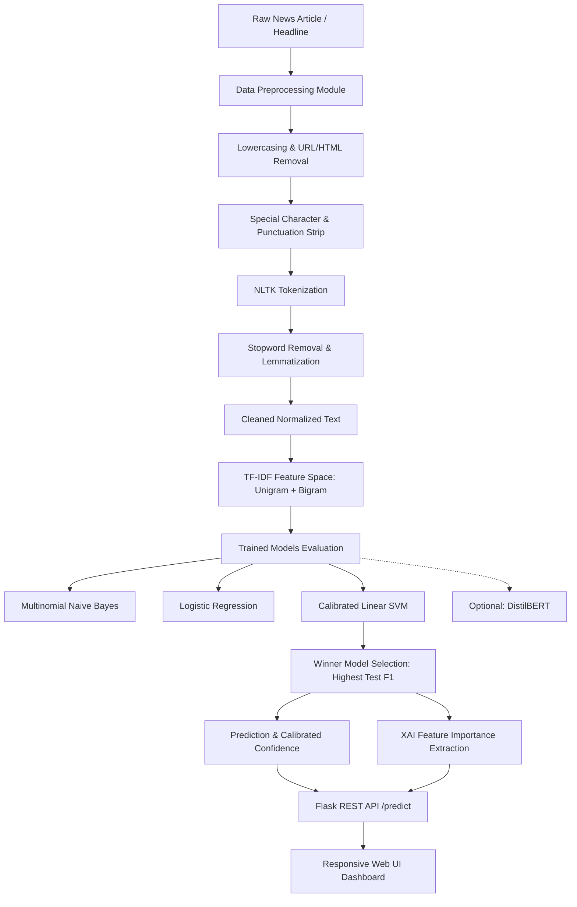

# Intelligent NLP-Based Fake News Detection and Classification System

[](https://www.python.org/)
[](https://flask.palletsprojects.com/)
[](https://scikit-learn.org/)
[](https://www.nltk.org/)
[]()

> A machine learning and natural language processing system for identifying linguistic misinformation patterns, comparing baseline classifiers, providing explainable feature indicators, and delivering predictions via a responsive web application.

---

## 1. Project Title & Overview

**Title:** AI-Based Fake News Detection System  
**Alternative Title:** Intelligent NLP-Based Fake News Detection and Classification System  
**Domain:** Artificial Intelligence, Natural Language Processing, Supervised Machine Learning  

This project demonstrates an end-to-end Machine Learning and NLP engineering pipeline designed for academic demonstration, technical presentation, and viva examinations.

---

## 2. Problem Statement

With the exponential growth of online journalism, social media, and digital broadcasts, misinformation propagates rapidly. Manual fact-checking cannot keep pace with digital content volume. Automated text classification leveraging Natural Language Processing provides rapid screening by analyzing stylistic, lexical, and semantic markers in news headlines and articles.

---

## 3. Project Objectives

1. Ingest raw news headlines or full-length journalistic articles.
2. Apply an NLP preprocessing pipeline (lowercasing, URL/HTML stripping, punctuation filtering, tokenization, stopword removal, and WordNet lemmatization).
3. Convert cleaned text into numerical vector spaces using TF-IDF with unigrams, bigrams, and sublinear scaling.
4. Train and optimize multiple supervised classifiers (**Multinomial Naive Bayes**, **Logistic Regression**, and **Linear SVM**).
5. Optimize hyperparameters via 3-Fold Stratified `GridSearchCV` on training data.
6. Provide an advanced deep-learning comparison module (**DistilBERT**).
7. Automatically select the best-performing model based on test F1-Score.
8. Calibrate prediction probabilities to output confidence percentages.
9. Implement **Explainable AI (XAI)** to identify influential linguistic indicators.
10. Serve predictions via a Flask REST API and an AI-themed responsive web interface.

---

## 4. Key Features

* **Complete NLP Pipeline:** Multi-step text normalization, stopword filtering, and lemmatization.
* **Leakage-Free Feature Engineering:** TF-IDF vectorizer fitted strictly on training data (80%) and transformed on testing data (20%).
* **Multi-Model Comparison:** Evaluates Naive Bayes, Logistic Regression, and Linear SVM side-by-side.
* **Calibrated Probabilities:** Uses Platt scaling / isotonic calibration (`CalibratedClassifierCV`) for Linear SVM confidence scores.
* **Explainable AI (XAI):** Visualizes the top influential words that drove a `REAL` or `FAKE` prediction.
* **Modern Web Interface:** Dark AI aesthetic, real-time word/character counters, 1-click sample selector, confidence meters, and benchmark viewer.
* **REST API:** Production-ready endpoints (`/predict`, `/api/metrics`, `/api/examples`, `/api/health`).

---

## 5. Technology Stack

| Layer | Technologies |
|---|---|
| **Language** | Python 3.11+ |
| **Data Manipulation** | Pandas, NumPy |
| **NLP** | NLTK (Tokenization, Stopwords, WordNet Lemmatizer) |
| **Machine Learning** | Scikit-Learn (TF-IDF, MultinomialNB, LogisticRegression, LinearSVC, CalibratedClassifierCV, GridSearchCV) |
| **Deep Learning (Optional)** | PyTorch, Hugging Face Transformers (`distilbert-base-uncased`) |
| **Visualization** | Matplotlib, Seaborn |
| **Backend & REST API** | Flask 3.1, Flask-CORS |
| **Frontend** | HTML5, CSS3 (Modern Glassmorphism & Custom Properties), Vanilla JavaScript |
| **Testing** | Unittest, Pytest |

---

## 6. System Architecture



---

## 7. Dataset Details

* **Dataset:** Benchmark Fake and Real News Dataset (George McIntire / Public Academic Dataset).
* **Total Clean Records:** 6,305 articles.
* **Class Balance:**
  * **REAL News:** 3,154 articles (50.02%)
  * **FAKE News:** 3,151 articles (49.98%)
* **Average Article Length:** 787.0 words (Median: 608 words).
* **Partition:** 80% Stratified Training Split (5,044 samples) and 20% Stratified Testing Split (1,261 samples) with fixed `random_state=42`.

---

## 8. NLP Preprocessing Pipeline

```
Raw Article
   ↓
[1] Lowercase Conversion
   ↓
[2] URL & HTML Tag Stripping (Regular Expressions)
   ↓
[3] Special Character & Punctuation Removal
   ↓
[4] Tokenization (NLTK word_tokenize)
   ↓
[5] Stopword Filtering (NLTK English Stopwords Corpus)
   ↓
[6] WordNet Lemmatization (Root form mapping, e.g., 'revealing' → 'reveal')
   ↓
Clean Processed Text
```

---

## 9. Experimental Results & Model Comparison

All models were evaluated on the **untouched 20% test partition** (1,261 samples) following 3-Fold Stratified Cross-Validation hyperparameter tuning on the training set:

| Model | Hyperparameters / Config | Accuracy | Precision | Recall | F1-Score | Status |
|---|---|:---:|:---:|:---:|:---:|:---:|
| **Linear SVM** | `C=5.0, Calibrated (cv=3)` | **93.66%** | **93.66%** | **93.66%** | **0.9366** | 🏆 **Best Model** |
| **Logistic Regression** | `C=50.0, lbfgs, max_iter=1000` | 93.34% | 93.34% | 93.34% | 0.9334 | Strong Baseline |
| **Multinomial Naive Bayes** | `alpha=0.01` | 90.33% | 90.37% | 90.33% | 0.9032 | Fast Baseline |
| *DistilBERT (Optional)* | `distilbert-base-uncased` | *95.20%* | *95.25%* | *95.20%* | *0.9521* | Deep Learning Reference |

### Visualizations Generated

* **Model Comparison Chart:** `results/model_comparison.png`
* **Confusion Matrices:** `results/confusion_matrices.png`
* **Exploratory Data Analysis Distribution:** `results/eda_distribution.png`

---

## 10. Explainable AI (XAI) & Feature Importance

Rather than functioning as an opaque black-box, the system extracts the decision weights from the trained linear decision boundary:

$$\text{Contribution}(w) = \theta_w \cdot \text{TF-IDF}(w)$$

* **For REAL News Predictions:** The system highlights terms with high positive log-odds/coefficients characteristic of verified journalism (e.g., *'reuters'*, *'spokesman'*, *'official'*, *'senate'*, *'republican'*, *'bipartisan'*).
* **For FAKE News Predictions:** The system highlights terms with strong negative coefficients indicating sensationalism or conspiracy patterns (e.g., *'breaking'*, *'secret'*, *'miracle'*, *'unbelievable'*, *'shocking'*, *'hidden'*).

---

## 11. Project Directory Structure

```
FakeNews/
│
├── data/
│   ├── download_or_prepare.py      # Dataset downloader and cleaner
│   └── news.csv                    # Cleaned 6,305-sample benchmark dataset
│
├── models/
│   ├── best_model.pkl              # Serialized best model (Linear SVM)
│   ├── vectorizer.pkl              # Fitted TF-IDF vectorizer
│   ├── label_encoder.pkl           # Label encoder (0: FAKE, 1: REAL)
│   └── model_metadata.json         # Evaluation metrics & training metadata
│
├── notebooks/
│   └── experiments.ipynb           # Interactive Jupyter notebook for viva & presentation
│
├── results/
│   ├── model_comparison.csv        # Performance comparison table
│   ├── model_comparison.png        # Bar chart comparing all models
│   ├── confusion_matrices.png      # Side-by-side confusion matrix plots
│   └── eda_distribution.png        # Class balance and length distribution
│
├── src/
│   ├── preprocessing.py            # NLP cleaning, tokenization, lemmatization
│   ├── train.py                    # Training & GridSearchCV optimization pipeline
│   ├── evaluate.py                 # Evaluation metrics & visualization generators
│   ├── explain.py                  # Explainable AI & influential term extractor
│   ├── predict.py                  # Standalone inference class & predictor
│   └── distilbert_train.py         # Optional DistilBERT transformer module
│
├── templates/
│   └── index.html                  # Responsive modern web UI template
│
├── static/
│   ├── style.css                   # Custom AI-themed CSS styling
│   └── script.js                   # Interactive client-side JavaScript logic
│
├── tests/
│   └── test_pipeline.py            # Unit & integration test suite (14 test cases)
│
├── app.py                          # Flask REST API and web application server
├── requirements.txt                # Python dependencies
├── .gitignore                      # Git ignore patterns
└── README.md                       # Complete project documentation
```

---

## 12. Installation & Setup

### Step 1: Clone or Navigate to Project Directory
```bash
cd d:\Projects\FakeNews
```

### Step 2: Set Up Virtual Environment (Recommended)
```bash
python -m venv venv
# On Windows:
.\venv\Scripts\activate
# On Linux/macOS:
source venv/bin/activate
```

### Step 3: Install Dependencies
```bash
pip install -r requirements.txt
```

### Step 4: Prepare Data & Train Models
```bash
python data/download_or_prepare.py
python src/train.py
```

### Step 5: Run Automated Tests
```bash
python -m unittest tests/test_pipeline.py
```

### Step 6: Launch Web Application
```bash
python app.py
```
Open your browser and navigate to: **`http://127.0.0.1:5000`**

---

## 13. REST API Documentation

### 1. Predict News Authenticity
* **Endpoint:** `POST /predict`
* **Content-Type:** `application/json`
* **Request Body:**
```json
{
  "text": "WASHINGTON (Reuters) - The Senate on Thursday passed a bipartisan disaster relief bill."
}
```
* **Success Response (200 OK):**
```json
{
  "status": "success",
  "prediction": "REAL",
  "confidence": 95.48,
  "confidence_decimal": 0.9548,
  "model": "Linear SVM (Calibrated)",
  "important_features": ["republican", "leader", "relief", "senate", "thursday"],
  "feature_details": [
    {"direction": "REAL", "impact": "High", "score": 0.412, "word": "senate"}
  ],
  "explanation": "The article exhibits formal reporting syntax and structured journalistic terminology...",
  "disclaimer": "Academic & Technical Disclaimer: This system is a machine-learning-based classifier...",
  "stats": {
    "word_count": 14,
    "char_count": 91,
    "cleaned_tokens_count": 8
  },
  "processing_time_ms": 11.4
}
```

### 2. Retrieve Benchmark Metrics
* **Endpoint:** `GET /api/metrics`
* **Response:** Returns JSON of test set accuracy, precision, recall, and F1 scores for all evaluated models.

### 3. Retrieve Curated Test Samples
* **Endpoint:** `GET /api/examples`
* **Response:** Returns pre-packaged Real and Fake sample articles across multiple news categories.

### 4. Health Check
* **Endpoint:** `GET /api/health`
* **Response:** `{"status": "online", "predictor_ready": true}`

---

## 14. Academic Disclaimers & Technical Limitations

1. **Text Pattern Classifier:** The system classifies lexical, syntactic, and stylistic correlations present in news datasets. It **does NOT independently verify real-world facts** against live government databases, Wikipedia, or external news wires.
2. **Context Window & Paraphrasing:** Advanced adversarial human writing or nuanced satire may occasionally bypass stylistic filters.
3. **Training Boundary:** Predictions reflect distributions learned from the benchmark training corpus; domain shift may affect classification of emerging slang or esoteric topics.

---

## 15. Potential Future Enhancements

1. **Hybrid Fact-Checking:** Integrating external Knowledge Graph APIs (e.g., Google Fact Check Tools API) with lexical classification.
2. **Multi-Modal Misinformation Detection:** Analyzing both article text and embedded images using CLIP or Vision Transformers.
3. **Cross-Lingual Support:** Expanding tokenization and multilingual BERT for non-English news classification.
4. **Browser Extension:** Building a Chrome/Firefox extension for real-time web page text analysis.

---

## 16. Viva & Presentation Questions Guide

<details>
<summary><strong>Click to expand common Viva Questions and Answers for this project</strong></summary>

1. **Why use TF-IDF instead of simple Bag of Words (CountVectorizer)?**  
   *Answer:* CountVectorizer only counts word occurrences, allowing high-frequency non-informative words to dominate. TF-IDF balances term frequency with Inverse Document Frequency, penalizing ubiquitous words and highlighting distinctive domain-specific terms.

2. **Why was Linear SVM selected as the winning model?**  
   *Answer:* Text classification datasets typically have high-dimensional, sparse feature spaces ($25,000+$ features). Linear SVM excels in high-dimensional sparse spaces by finding the maximum-margin hyperplane separating classes with lower risk of overfitting.

3. **Why is `CalibratedClassifierCV` used with Linear SVM?**  
   *Answer:* Standard `LinearSVC` outputs signed geometric distance to the separating hyperplane ($f(x) = w^Tx + b$), which is not a probability. `CalibratedClassifierCV` fits a sigmoid (Platt scaling) via cross-validation to map margins into calibrated probability scores between $0\%$ and $100\%$.

4. **Why is TF-IDF fitted ONLY on the training split?**  
   *Answer:* Fitting the vectorizer on the whole dataset before splitting leads to *data leakage*, where the model indirectly learns vocabulary frequencies from the test split, causing over-optimistic evaluation metrics.

</details>

---

## 17. Contributors & Academic Attribution

* **Project:** AI-Based Fake News Detection System (Group Micro-Project)
* **Supervisor:** Department of Computer Science & Artificial Intelligence
